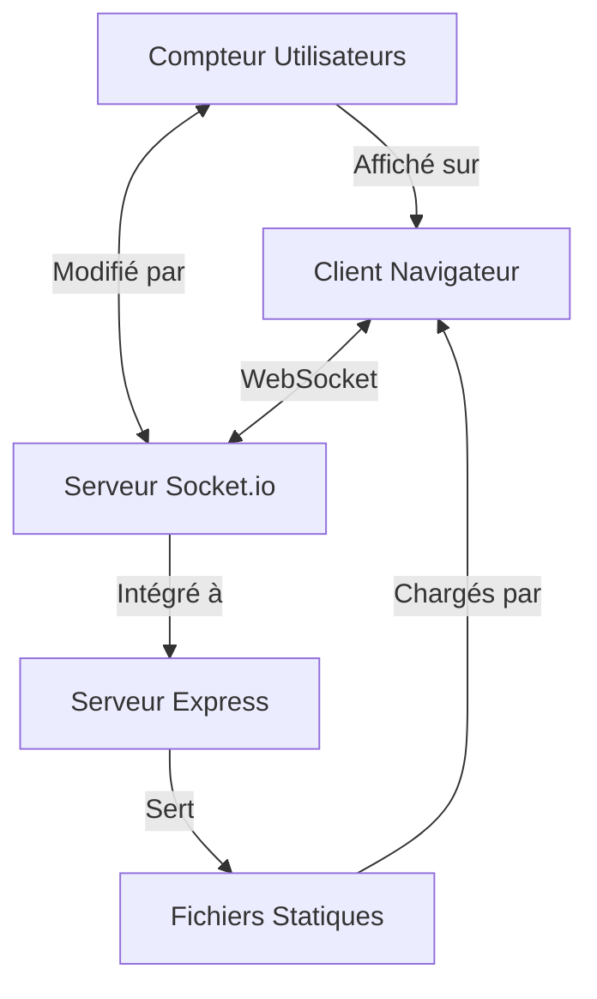

# Prototype WebSocket Temps-Réel

Un prototype WebSocket simple mais complet qui implémente un suivi de connexions utilisateur en temps réel avec fonctionnalités avancées.

## 📋 Fonctionnalités

- ✅ Affichage du nombre d'utilisateurs connectés en temps réel
- ⏳ Listing des utilisateurs connectés avec IDs auto-incrémentés
- ⏳ Système de réinitialisation automatique après 20 secondes sans connexions
- ⏳ Interface utilisateur intuitive

## 🔍 Aperçu de l'architecture



## 🛠️ Technologies utilisées

- **Backend**: Node.js, Express, Socket.io
- **Frontend**: HTML, CSS, JavaScript (vanilla)
- **Documentation**: Markdown, diagrammes Mermaid

## 🚀 Installation et démarrage

```bash
# Cloner le projet
git clone https://github.com/username/websocket-demo.git
cd websocket-demo

# Installer les dépendances
npm install

# Démarrer le serveur
node server/index.js
```

Ouvrez ensuite votre navigateur sur `http://localhost:3000`

Pour tester le compteur d'utilisateurs:
1. Ouvrez la page dans un premier onglet
2. Ouvrez la page dans un deuxième onglet - le compteur devrait passer à 2
3. Fermez un des onglets - le compteur devrait revenir à 1

## 📂 Structure du projet

```
websocket-demo/
├── public/
│   ├── css/           # Styles de l'interface
│   │   └── style.css
│   ├── js/            # JavaScript client
│   │   └── client.js
│   └── index.html     # Interface utilisateur
├── server/
│   └── index.js       # Serveur Express + WebSocket
├── docs/
│   └── technical.md   # Documentation technique détaillée
└── package.json       # Configuration du projet
```

## ✅ Étapes d'implémentation

- [x] Structure initiale - Serveur Express et fichiers de base
- [x] WebSocket basique - Communication bidirectionnelle client-serveur
- [x] Compteur d'utilisateurs - Suivi et affichage des connexions
- [ ] Système d'IDs - Attribution d'identifiants uniques
- [ ] Listing d'utilisateurs - Affichage des utilisateurs connectés
- [ ] Compte à rebours - Réinitialisation après déconnexion
- [ ] Amélioration UI - Interface utilisateur soignée
- [ ] Documentation finale - Finalisation de la documentation

## 📚 Documentation technique

Pour plus de détails techniques sur l'implémentation, consultez [la documentation technique](docs/technical.md).