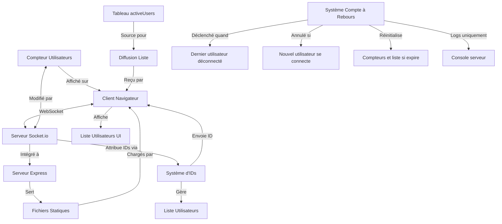

# Prototype WebSocket Temps-Réel

Un prototype WebSocket simple mais complet qui implémente un suivi de connexions utilisateur en temps réel avec fonctionnalités avancées.

## 📋 Fonctionnalités

- ✅ Affichage du nombre d'utilisateurs connectés en temps réel
- ✅ Listing des utilisateurs connectés avec IDs auto-incrémentés
- ✅ Affichage de la liste des utilisateurs avec leurs heures de connexion
- ✅ Système de réinitialisation automatique après 20 secondes sans connexions (côté serveur)
- ⏳ Interface utilisateur intuitive

## 🔍 Aperçu de l'architecture



## 🛠️ Technologies utilisées

- **Backend**: Node.js, Express, Socket.io
- **Frontend**: HTML, CSS, JavaScript (vanilla)
- **Documentation**: Markdown, diagrammes Mermaid

## 🚀 Installation et démarrage

```bash
# Cloner le projet
git clone https://github.com/username/websocket-demo.git
cd websocket-demo

# Installer les dépendances
npm install

# Démarrer le serveur
node server/index.js
```

Ouvrez ensuite votre navigateur sur `http://localhost:3000`

Pour tester les fonctionnalités en temps réel:
1. Ouvrez la page dans un premier onglet - vous aurez l'ID #1
2. Ouvrez un deuxième onglet - vous aurez l'ID #2 et verrez les deux utilisateurs dans la liste
3. Ouvrez un troisième onglet - vous verrez les trois utilisateurs dans la liste
4. Fermez un des onglets - il disparaîtra instantanément de toutes les listes
5. Fermez tous les onglets - le serveur démarrera un compte à rebours de 20 secondes (visible dans les logs)
6. Si vous reconnectez avant la fin du décompte, le système continuera normalement
7. Si vous attendez la fin du décompte, le système se réinitialisera et les nouveaux utilisateurs recevront des IDs à partir de 1

## 📂 Structure du projet

```
websocket-demo/
├── public/
│   ├── css/           # Styles de l'interface
│   │   └── style.css
│   ├── js/            # JavaScript client
│   │   └── client.js
│   └── index.html     # Interface utilisateur
├── server/
│   └── index.js       # Serveur Express + WebSocket
├── docs/
│   └── technical.md   # Documentation technique détaillée
└── package.json       # Configuration du projet
```

## ✅ Étapes d'implémentation

- [x] Structure initiale - Serveur Express et fichiers de base
- [x] WebSocket basique - Communication bidirectionnelle client-serveur
- [x] Compteur d'utilisateurs - Suivi et affichage des connexions
- [x] Système d'IDs - Attribution d'identifiants uniques
- [x] Listing d'utilisateurs - Affichage de la liste des utilisateurs connectés
- [x] Compte à rebours - Réinitialisation après déconnexion (optimisé côté serveur uniquement)
- [ ] Amélioration UI - Interface utilisateur soignée
- [ ] Documentation finale - Finalisation de la documentation

## 📚 Documentation technique

Pour plus de détails techniques sur l'implémentation, consultez [la documentation technique](docs/technical.md).