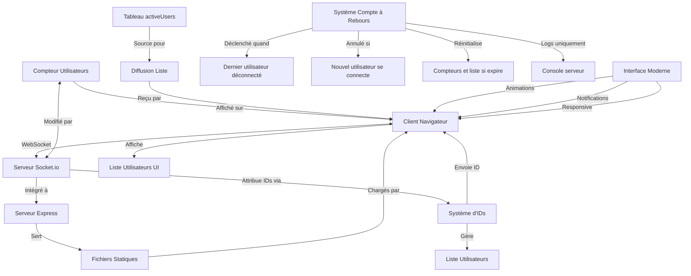

# Prototype WebSocket Temps-Réel

Un prototype WebSocket simple mais complet qui implémente un suivi de connexions utilisateur en temps réel avec fonctionnalités avancées et une interface moderne.

## 📋 Fonctionnalités

- ✅ Affichage du nombre d'utilisateurs connectés en temps réel
- ✅ Listing des utilisateurs connectés avec IDs auto-incrémentés
- ✅ Affichage de la liste des utilisateurs avec leurs heures de connexion
- ✅ Système de réinitialisation automatique après 20 secondes sans connexions (côté serveur)
- ✅ Interface utilisateur moderne et responsive
- ✅ Animations fluides et transitions visuelles
- ✅ Notifications en temps réel pour les événements
- ✅ Design adaptatif (mobile, tablette, desktop)

## 🎨 Caractéristiques de l'interface

- **Design moderne** : Interface épurée avec dégradés et ombres subtiles
- **Animations fluides** : Transitions CSS et animations JavaScript pour une expérience engageante
- **Responsive design** : S'adapte automatiquement à tous les appareils 
- **Notifications visuelles** : Alertes temporaires pour les événements importants
- **Indicateurs en temps réel** : Statut de connexion animé et compteurs dynamiques
- **Accessibilité améliorée** : Structure sémantique et contrastes optimisés

## 🔍 Aperçu de l'architecture



## 🛠️ Technologies utilisées

- **Backend**: Node.js, Express, Socket.io
- **Frontend**: HTML5, CSS3 (Grid/Flexbox), JavaScript ES6+
- **Design**: Google Fonts (Inter), CSS Variables, Animations CSS/JS
- **Documentation**: Markdown, diagrammes Mermaid

## 🚀 Installation et démarrage

```bash
# Cloner le projet
git clone https://github.com/username/websocket-demo.git
cd websocket-demo

# Installer les dépendances
npm install

# Démarrer le serveur
node server/index.js
```

Ouvrez ensuite votre navigateur sur `http://localhost:3000`

## 🧪 Test des fonctionnalités

Pour tester toutes les fonctionnalités en temps réel:

1. **Test de base**:
   - Ouvrez la page dans un premier onglet - vous aurez l'ID #1 avec une notification
   - Observez l'animation du compteur et les effets visuels

2. **Test multi-utilisateurs**:
   - Ouvrez un deuxième onglet - vous aurez l'ID #2 
   - Observez la liste des utilisateurs se mettre à jour avec animations
   - Votre utilisateur actuel sera mis en évidence

3. **Test des animations**:
   - Ouvrez/fermez des onglets rapidement pour voir les transitions fluides
   - Les compteurs s'animent lors des changements
   - Les nouveaux utilisateurs apparaissent avec un effet de glissement

4. **Test du système de réinitialisation**:
   - Fermez tous les onglets - le serveur démarrera un compte à rebours de 20 secondes (logs console)
   - Reconnectez-vous avant la fin pour annuler, ou attendez pour voir la réinitialisation
   - Les nouveaux utilisateurs après réinitialisation recevront des IDs à partir de 1

5. **Test responsive**:
   - Redimensionnez votre navigateur ou testez sur mobile
   - L'interface s'adapte automatiquement à la taille d'écran

## 📂 Structure du projet

```
websocket-demo/
├── public/
│   ├── css/           # Styles modernes avec animations
│   │   └── style.css
│   ├── js/            # JavaScript client avec améliorations UX
│   │   └── client.js
│   └── index.html     # Interface utilisateur responsive
├── server/
│   └── index.js       # Serveur Express + WebSocket + compte à rebours
├── docs/
│   └── technical.md   # Documentation technique détaillée
└── package.json       # Configuration du projet
```

## ✅ Étapes d'implémentation

- [x] Structure initiale - Serveur Express et fichiers de base
- [x] WebSocket basique - Communication bidirectionnelle client-serveur
- [x] Compteur d'utilisateurs - Suivi et affichage des connexions
- [x] Système d'IDs - Attribution d'identifiants uniques
- [x] Listing d'utilisateurs - Affichage de la liste des utilisateurs connectés
- [x] Compte à rebours - Réinitialisation après déconnexion (optimisé côté serveur uniquement)
- [x] Amélioration UI - Interface utilisateur moderne et responsive
- [ ] Documentation finale - Finalisation complète de la documentation

## 🎯 Prochaines améliorations possibles

- Ajout de salles de discussion (rooms)
- Système de messages entre utilisateurs
- Statistiques détaillées de connexion
- Tableau de bord administrateur
- API REST pour intégration externe
- Tests automatisés (Jest/Mocha)

## 📚 Documentation technique

Pour plus de détails techniques sur l'implémentation, consultez [la documentation technique](docs/technical.md).