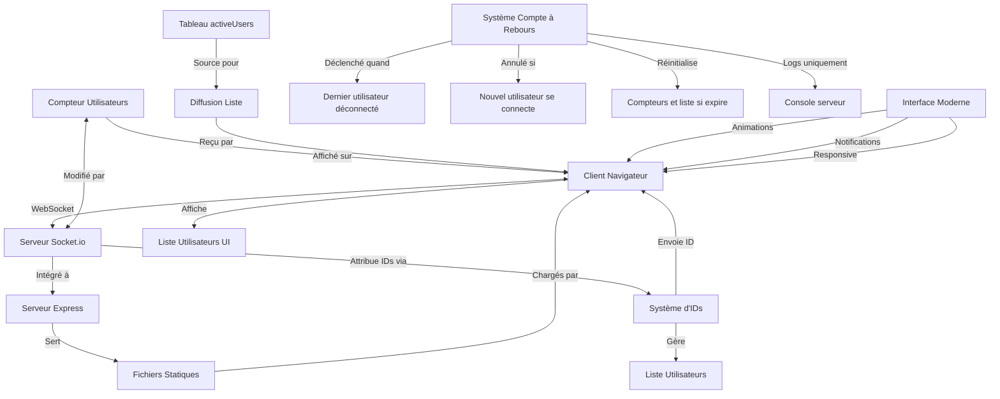

# Prototype WebSocket Temps-Réel

Un prototype WebSocket simple mais complet qui implémente un suivi de connexions utilisateur en temps réel avec fonctionnalités avancées et une interface moderne.

## 📋 Fonctionnalités

- ✅ Affichage du nombre d'utilisateurs connectés en temps réel
- ✅ Listing des utilisateurs connectés avec IDs auto-incrémentés
- ✅ Affichage de la liste des utilisateurs avec leurs heures de connexion
- ✅ Système de réinitialisation automatique après 20 secondes sans connexions
- ✅ Interface utilisateur moderne et responsive
- ✅ Animations fluides et transitions visuelles
- ✅ Notifications en temps réel pour les événements
- ✅ Design adaptatif (mobile, tablette, desktop)

## 🎨 Caractéristiques de l'interface

- **Design moderne** : Interface épurée avec dégradés et ombres subtiles
- **Animations fluides** : Transitions CSS et animations JavaScript pour une expérience engageante
- **Responsive design** : S'adapte automatiquement à tous les appareils 
- **Notifications visuelles** : Alertes temporaires pour les événements importants
- **Indicateurs en temps réel** : Statut de connexion animé et compteurs dynamiques
- **Accessibilité améliorée** : Structure sémantique et contrastes optimisés

## 🔍 Aperçu de l'architecture



## 🛠️ Technologies utilisées

- **Backend**: Node.js, Express, Socket.io
- **Frontend**: HTML5, CSS3 (Grid/Flexbox), JavaScript ES6+
- **Design**: Google Fonts (Inter), CSS Variables, Animations CSS/JS
- **Documentation**: Markdown, diagrammes Mermaid

## 🚀 Installation et démarrage

### Prérequis

- Node.js (version 14 ou supérieure)
- npm (généralement inclus avec Node.js)
- Un navigateur moderne (Chrome 49+, Firefox 31+, Safari 9.1+, Edge 16+)

### Installation rapide

```bash
# Cloner le projet
git clone https://github.com/username/websocket-demo.git
cd websocket-demo

# Installer les dépendances
npm install

# Démarrer le serveur en mode développement
npm start
```

### Installation manuelle

1. **Télécharger le projet**
   ```bash
   git clone https://github.com/username/websocket-demo.git
   cd websocket-demo
   ```

2. **Installer les dépendances**
   ```bash
   npm install
   ```

3. **Vérifier la structure des fichiers**
   ```
   websocket-demo/
   ├── public/
   │   ├── css/style.css
   │   ├── js/client.js
   │   └── index.html
   ├── server/
   │   └── index.js
   ├── docs/
   │   └── technical.md
   ├── package.json
   └── README.md
   ```

4. **Démarrer le serveur**
   ```bash
   node server/index.js
   ```

5. **Accéder à l'application**
   - Ouvrez votre navigateur sur `http://localhost:3000`
   - Vous devriez voir l'interface de démonstration WebSocket

### Configuration avancée

#### Changer le port

Modifiez la variable `PORT` dans `server/index.js` :
```javascript
const PORT = 8080; // Changez 3000 par le port désiré
```

#### Modifier la durée du compte à rebours

Changez la constante `COUNTDOWN_DURATION` dans `server/index.js` :
```javascript
const COUNTDOWN_DURATION = 30; // 30 secondes au lieu de 20
```

## 🧪 Guide de test complet

### 1. Test de base
- **Action** : Ouvrez la page dans un navigateur
- **Résultat attendu** : Vous recevez l'ID #1 avec une notification de connexion
- **Observation** : Le compteur affiche 1, votre ID apparaît avec un effet pulse

### 2. Test multi-utilisateurs
- **Action** : Ouvrez plusieurs onglets ou navigateurs
- **Résultat attendu** : Chaque nouvel onglet reçoit un ID incrémentiel (#2, #3, etc.)
- **Observation** : La liste des utilisateurs se met à jour avec des animations d'entrée

### 3. Test des animations
- **Action** : Ouvrez et fermez des onglets rapidement
- **Résultat attendu** : Transitions fluides, compteurs animés, notifications visuelles
- **Observation** : L'utilisateur actuel est mis en évidence dans la liste

### 4. Test du système de réinitialisation
- **Action** : Fermez tous les onglets et observez la console serveur
- **Résultat attendu** : Compte à rebours de 20 secondes dans les logs
- **Observation** : Reconnexion avant la fin annule le compte à rebours

### 5. Test responsive
- **Action** : Redimensionnez la fenêtre ou testez sur mobile
- **Résultat attendu** : L'interface s'adapte automatiquement
- **Observation** : Les éléments se réorganisent pour rester lisibles

### 6. Test de performance
- **Action** : Ouvrez de nombreux onglets (10-20)
- **Résultat attendu** : L'application reste fluide
- **Observation** : Pas de ralentissement visible dans les animations

## 📂 Structure détaillée du projet

```
websocket-demo/
├── public/                     # Fichiers statiques servis par Express
│   ├── css/
│   │   └── style.css          # Styles modernes avec animations et responsive
│   ├── js/
│   │   └── client.js          # Client WebSocket avec améliorations UX
│   └── index.html             # Interface utilisateur responsive
├── server/
│   └── index.js               # Serveur Express + WebSocket + logique métier
├── docs/
│   └── technical.md           # Documentation technique détaillée
├── .gitignore                 # Fichiers ignorés par Git
├── package.json               # Configuration npm et dépendances
└── README.md                  # Ce fichier - documentation principale
```

## ✅ Fonctionnalités implémentées (développement complet)

- [x] **Structure initiale** - Serveur Express et fichiers de base
- [x] **WebSocket basique** - Communication bidirectionnelle client-serveur
- [x] **Compteur d'utilisateurs** - Suivi et affichage des connexions en temps réel
- [x] **Système d'IDs** - Attribution d'identifiants uniques auto-incrémentés
- [x] **Listing d'utilisateurs** - Affichage de la liste des utilisateurs connectés
- [x] **Compte à rebours** - Réinitialisation automatique après inactivité (côté serveur)
- [x] **Amélioration UI** - Interface utilisateur moderne et responsive
- [x] **Documentation finale** - Documentation complète et guides d'utilisation

## 🎯 Idées d'extensions futures

### Extensions simples
- **Personnalisation des couleurs** : Permettre à l'utilisateur de choisir un thème
- **Pseudonymes** : Permettre aux utilisateurs de définir un nom d'affichage
- **Messages de bienvenue** : Afficher un message personnalisé aux nouveaux arrivants

### Extensions intermédiaires
- **Salles de discussion** : Créer des "rooms" pour séparer les utilisateurs
- **Historique des connexions** : Garder un log des connexions/déconnexions
- **API REST** : Exposer des statistiques via des endpoints HTTP

### Extensions avancées
- **Authentification** : Système de login avec sessions persistantes
- **Base de données** : Persistance des données utilisateur avec MongoDB/PostgreSQL
- **Clustering** : Support de plusieurs instances serveur avec Redis
- **Tests automatisés** : Suite de tests avec Jest/Mocha pour la CI/CD

## 🐛 Résolution de problèmes

### Le serveur ne démarre pas
```bash
# Vérifiez que Node.js est installé
node --version

# Vérifiez que les dépendances sont installées
npm list

# Réinstallez les dépendances si nécessaire
rm -rf node_modules package-lock.json
npm install
```

### Erreur "Port déjà utilisé"
```bash
# Trouvez le processus utilisant le port 3000
lsof -i :3000  # Sur macOS/Linux
netstat -ano | findstr :3000  # Sur Windows

# Tuez le processus ou changez le port dans server/index.js
```

### WebSocket ne se connecte pas
- Vérifiez que le serveur est démarré et accessible sur `http://localhost:3000`
- Désactivez temporairement les bloqueurs de publicité/VPN
- Vérifiez la console du navigateur (F12) pour d'éventuelles erreurs

### Animations saccadées
- Fermez les autres onglets pour libérer des ressources
- Vérifiez que vous utilisez un navigateur récent
- Désactivez les animations CSS si nécessaire (accessibilité)

## 🤝 Contribution

### Guide pour les développeurs

1. **Fork** ce repository
2. **Créez une branche** pour votre fonctionnalité (`git checkout -b feature/nouvelle-fonctionnalite`)
3. **Commitez** vos changements (`git commit -am 'Ajout nouvelle fonctionnalité'`)
4. **Push** vers la branche (`git push origin feature/nouvelle-fonctionnalite`)
5. **Créez une Pull Request**

### Standards de code

- **JavaScript** : Utilisez ES6+ et des noms de variables descriptifs
- **CSS** : Respectez les conventions BEM pour les classes
- **Documentation** : Commentez le code complexe et mettez à jour le README
- **Tests** : Testez manuellement toutes les fonctionnalités avant de soumettre

## 📚 Documentation technique

Pour les détails techniques d'implémentation, les diagrammes avancés et les notes de développement, consultez la [documentation technique détaillée](docs/technical.md).

## 📄 Licence

Ce projet est sous licence MIT. Consultez le fichier `LICENSE` pour plus de détails.

## 👨‍💻 Auteur

Créé comme prototype éducatif pour démontrer les concepts WebSocket avec Node.js et Socket.io.

## 🙏 Remerciements

- [Socket.io](https://socket.io/) pour la bibliothèque WebSocket
- [Express](https://expressjs.com/) pour le framework web
- [Inter](https://rsms.me/inter/) pour la police de caractères
- La communauté open source pour l'inspiration et les bonnes pratiques