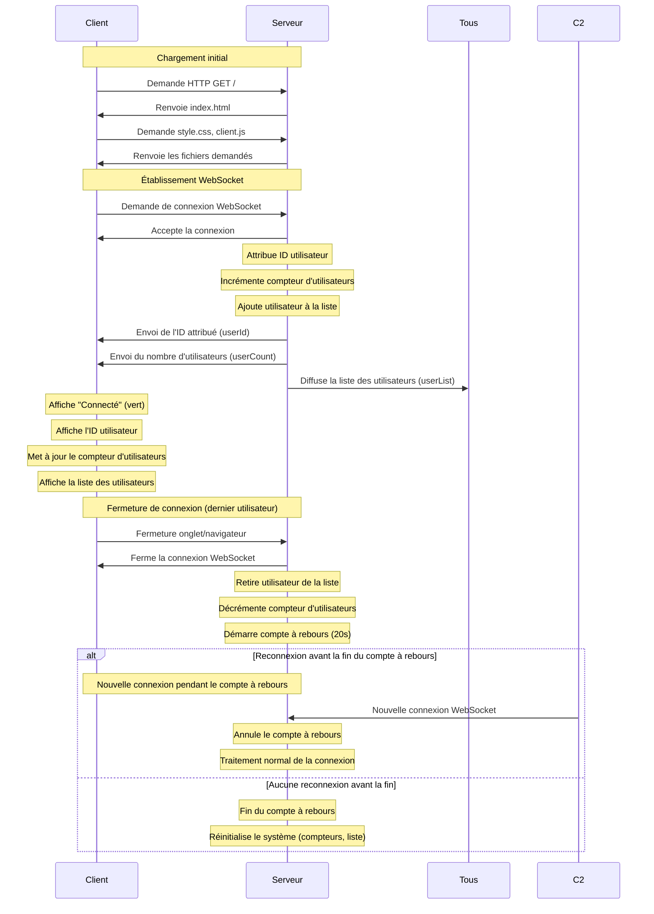

# Documentation Technique - Détails d'implémentation

Cette documentation technique complète le [README.md](../README.md) en fournissant des détails d'implémentation pour les développeurs.

## Détails d'architecture

### Diagramme de séquence détaillé



### Diagramme du système de compte à rebours (optimisé serveur uniquement)

```mermaid
graph TD
    A[Dernier utilisateur se déconnecte] -->|connectedUsers === 0| B[Démarrage du compte à rebours]
    B -->|startCountdown()| C[Initialisation minuteur]
    C -->|Toutes les secondes| D{Temps restant > 0?}
    
    D -->|Oui| E[Mise à jour du temps]
    E -->|console.log| F[Log serveur uniquement]
    F --> D
    
    D -->|Non| G[Réinitialisation du système]
    G -->|resetSystem()| H[Remise à zéro des compteurs]
    H -->|console.log| I[Log serveur de réinitialisation]
    
    J[Nouvel utilisateur se connecte] -->|Pendant compte à rebours| K[Annulation du compte à rebours]
    K -->|cancelCountdown()| L[Arrêt du minuteur]
    L -->|console.log| M[Log serveur d'annulation]
```

## Flux de données détaillé

### Côté serveur (server/index.js)

Le système de compte à rebours optimisé est implémenté uniquement côté serveur:

```javascript
// Variables pour le compte à rebours
let countdownTimer = null;
const COUNTDOWN_DURATION = 20; // durée en secondes
let countdownRemaining = 0;

// Démarrage du compte à rebours quand le dernier utilisateur se déconnecte
function startCountdown() {
    // Initialisation du temps restant
    countdownRemaining = COUNTDOWN_DURATION;
    
    // Envoyer une mise à jour chaque seconde (uniquement logs serveur)
    countdownTimer = setInterval(() => {
        countdownRemaining--;
        console.log(`Compte à rebours: ${countdownRemaining} secondes restantes`);
        
        // Si le compte à rebours est terminé
        if (countdownRemaining <= 0) {
            resetSystem();
        }
    }, 1000);
    
    console.log(`Compte à rebours démarré: ${COUNTDOWN_DURATION} secondes`);
}

// Annulation du compte à rebours quand un utilisateur se connecte
function cancelCountdown() {
    if (countdownTimer) {
        clearInterval(countdownTimer);
        countdownTimer = null;
        countdownRemaining = 0;
        
        console.log('Compte à rebours annulé');
    }
}

// Réinitialisation du système après le compte à rebours
function resetSystem() {
    // Arrêter le compte à rebours
    if (countdownTimer) {
        clearInterval(countdownTimer);
        countdownTimer = null;
    }
    
    // Réinitialiser les compteurs
    nextUserId = 1;
    
    console.log('Système réinitialisé');
}
```

### Côté client (public/js/client.js)

Le client ne gère plus les événements de compte à rebours, se concentrant uniquement sur les fonctionnalités visibles:

```javascript
// Seuls les événements utiles sont conservés
socket.on('connect', () => { /* Gestion de la connexion */ });
socket.on('disconnect', () => { /* Gestion de la déconnexion */ });
socket.on('userCount', (count) => { /* Mise à jour du compteur */ });
socket.on('userId', (id) => { /* Affichage de l'ID utilisateur */ });
socket.on('userList', (users) => { /* Affichage de la liste d'utilisateurs */ });
```

## Notes d'implémentation

### Optimisation du système de compte à rebours

**Problème identifié**: Le code client pour afficher le compte à rebours était superflu car, par définition, quand le compte à rebours démarre, aucun utilisateur n'est connecté pour le voir.

**Solution appliquée**: 
- Conservation de la logique serveur complète (minuteur, réinitialisation)
- Suppression de tous les événements WebSocket liés à l'affichage
- Suppression du code HTML/CSS/JavaScript côté client
- Conservation des logs serveur pour le suivi et le débogage

**Avantages de cette optimisation**:
1. **Performance améliorée**: Moins d'événements WebSocket à traiter
2. **Code plus propre**: Suppression de code mort
3. **Logique plus claire**: Séparation nette entre ce qui est visible (interface) et ce qui est technique (réinitialisation)
4. **Maintenance simplifiée**: Moins de code à maintenir

### Fonctionnement des minuteurs JavaScript

Le système utilise les fonctions natives JavaScript pour la gestion du temps:

- **setInterval(callback, délai)**: Exécute une fonction de façon répétée à intervalles réguliers
- **clearInterval(id)**: Arrête le minuteur identifié par l'ID retourné par setInterval

Ces mécanismes permettent de créer des fonctionnalités temporelles sans bloquer l'exécution du reste du code.

### États du système

Le système a plusieurs états possibles:
1. **Actif**: Au moins un utilisateur est connecté
2. **Compte à rebours**: Aucun utilisateur connecté, minuteur en cours (visible uniquement dans les logs serveur)
3. **Réinitialisé**: Après la fin du compte à rebours, prêt pour de nouvelles connexions avec des IDs réinitialisés

## Détails d'implémentation par étape

### Étape 6: Compte à rebours (optimisé)

- Implémentation d'un système de compte à rebours de 20 secondes côté serveur uniquement
- Démarrage automatique lorsque le dernier utilisateur se déconnecte
- Annulation automatique si un utilisateur se reconnecte avant la fin
- Réinitialisation du système à la fin du compte à rebours
- Logs serveur pour le suivi et le débogage
- Suppression de tout le code client superflu pour une meilleure performance

### Prochaines implémentations

#### Amélioration UI

Pour la prochaine étape, nous allons améliorer l'interface utilisateur:

- Regrouper et harmoniser les éléments visuels
- Ajouter des effets de transition entre les états
- Optimiser la disposition pour tous les appareils (responsive design)
- Améliorer l'accessibilité et la convivialité
- Ajouter des icônes et indicateurs visuels