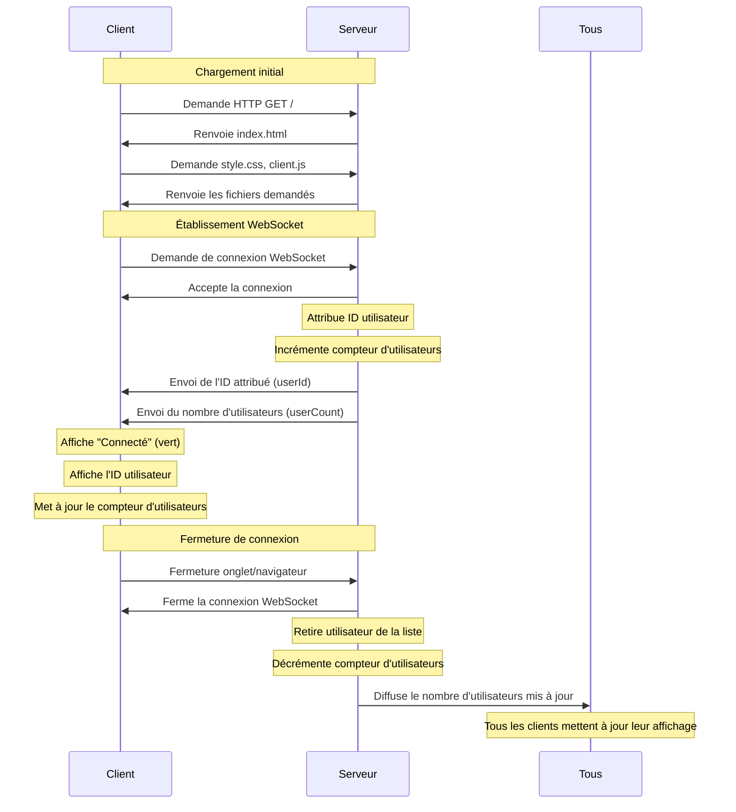
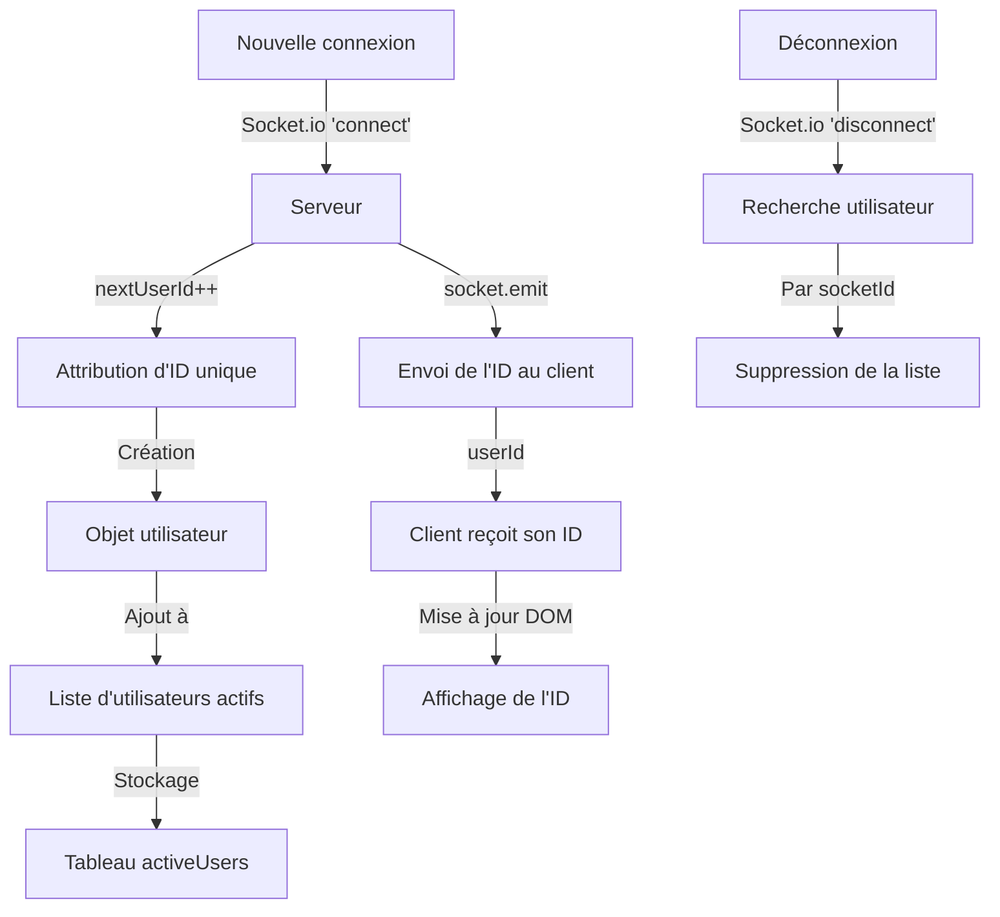

# Documentation Technique - Détails d'implémentation

Cette documentation technique complète le [README.md](../README.md) en fournissant des détails d'implémentation pour les développeurs.

## Détails d'architecture

### Diagramme de séquence détaillé



### Diagramme du système d'IDs



## Flux de données détaillé

### Côté serveur (server/index.js)

La gestion des IDs utilisateurs est implémentée comme suit:

```javascript
// Variables pour suivre les utilisateurs et le compteur
let connectedUsers = 0;
let nextUserId = 1;
const activeUsers = [];

// Nouvelle connexion
io.on('connection', (socket) => {
  // Attribution d'un ID unique à l'utilisateur
  const userId = nextUserId++;
  
  // Stockage des informations de l'utilisateur
  const userInfo = {
    id: userId,
    socketId: socket.id,
    connectionTime: new Date().toISOString()
  };
  
  // Ajout de l'utilisateur à la liste des utilisateurs actifs
  activeUsers.push(userInfo);
  
  // Envoi des informations à l'utilisateur qui vient de se connecter
  socket.emit('userId', userId);
  
  // Déconnexion
  socket.on('disconnect', () => {
    // Recherche et suppression de l'utilisateur de la liste des actifs
    const userIndex = activeUsers.findIndex(user => user.socketId === socket.id);
    if (userIndex !== -1) {
      activeUsers.splice(userIndex, 1);
    }
  });
});
```

### Côté client (public/js/client.js)

Le client reçoit et affiche son ID comme suit:

```javascript
// Référence à l'élément DOM pour l'ID utilisateur
const userIdElement = document.getElementById('user-id');

// Réception de l'ID utilisateur
socket.on('userId', (id) => {
    if (userIdElement) {
        userIdElement.textContent = id.toString();
    }
});
```

## Notes d'implémentation

### Système d'attribution d'IDs

Le système d'attribution d'IDs est simple mais efficace:

1. Une variable `nextUserId` commence à 1 et s'incrémente à chaque nouvelle connexion
2. L'ID est attribué AVANT l'incrémentation (post-incrémentation)
3. Cette approche garantit que chaque connexion reçoit un identifiant unique
4. Les IDs restent uniques même après des déconnexions/reconnexions

### Stockage des informations utilisateur

Chaque utilisateur est représenté par un objet contenant:

```javascript
{
  id: 1,                           // ID attribué séquentiellement
  socketId: 'abc123',              // ID technique de Socket.io
  connectionTime: '2025-05-05T...' // Horodatage ISO de la connexion
}
```

Ces informations sont stockées dans un tableau `activeUsers` qui:
- Garde une trace de tous les utilisateurs connectés
- Est mis à jour lors des connexions/déconnexions
- Permet de retrouver un utilisateur via son socketId lors d'une déconnexion

## Détails d'implémentation par étape

### Étape 3: Compteur d'utilisateurs

- Suivi du nombre d'utilisateurs connectés avec une variable
- Mise à jour du compteur lors des événements de connexion/déconnexion
- Diffusion des mises à jour à tous les clients connectés
- Affichage du compteur dans l'interface utilisateur

### Étape 4: Système d'IDs

- Attribution d'ID séquentiel (auto-incrémenté) à chaque nouvelle connexion
- Stockage des informations utilisateur dans un tableau
- Envoi de l'ID attribué au client concerné
- Affichage de l'ID dans l'interface utilisateur
- Nettoyage des informations utilisateur lors de la déconnexion

### Prochaines implémentations

#### Listing d'utilisateurs

Pour la prochaine étape, nous allons implémenter un listing complet des utilisateurs connectés:

- Envoyer la liste complète des utilisateurs connectés à tous les clients
- Mettre à jour cette liste à chaque connexion/déconnexion
- Afficher cette liste dans l'interface utilisateur
- Inclure les IDs et heures de connexion dans l'affichage