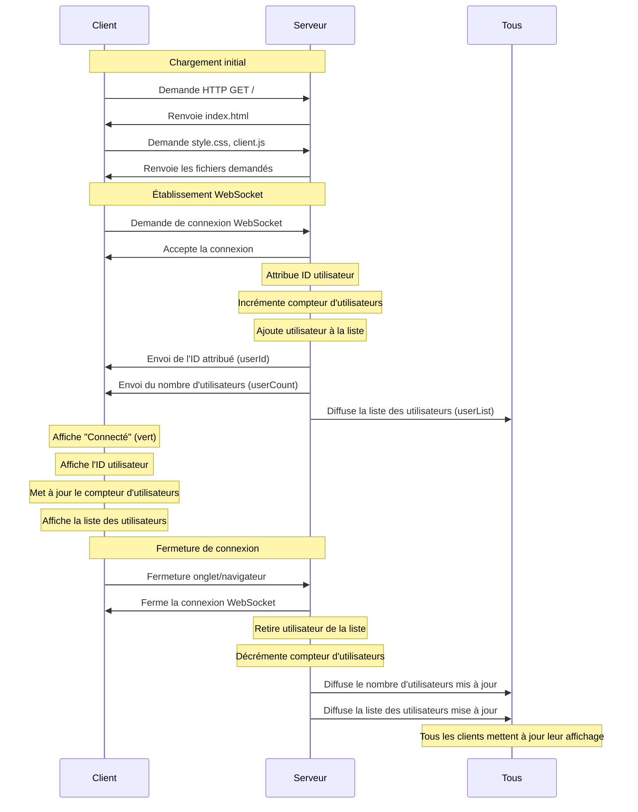
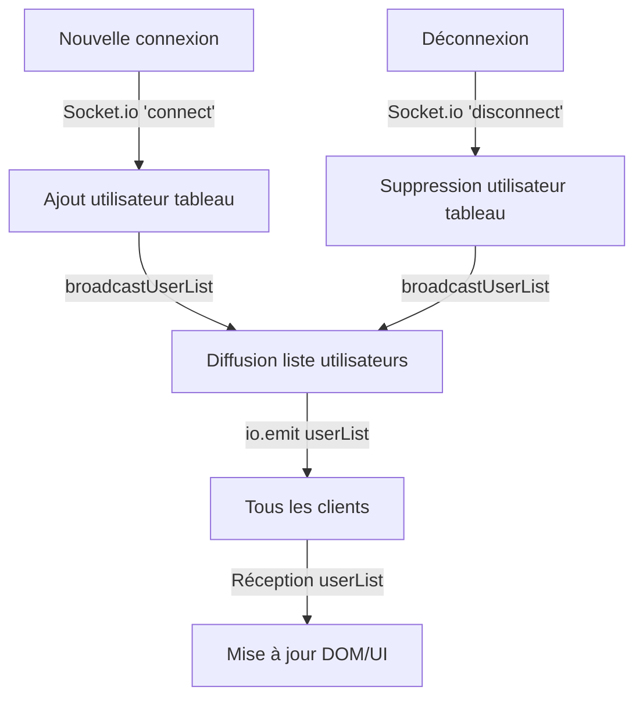

# Documentation Technique - Détails d'implémentation

Cette documentation technique complète le [README.md](../README.md) en fournissant des détails d'implémentation pour les développeurs.

## Détails d'architecture

### Diagramme de séquence détaillé



### Diagramme du système de liste d'utilisateurs



## Flux de données détaillé

### Côté serveur (server/index.js)

La diffusion de la liste des utilisateurs est implémentée comme suit:

```javascript
// Fonction utilitaire pour diffuser la liste des utilisateurs
function broadcastUserList() {
    // Création d'une version simplifiée de la liste sans les socketIds
    const userList = activeUsers.map(user => ({
        id: user.id,
        connectionTime: user.connectionTime
    }));
    
    // Envoi de la liste à tous les clients
    io.emit('userList', userList);
}

// Appeler cette fonction lors de chaque connexion/déconnexion
io.on('connection', (socket) => {
    // ... code existant ...
    
    // Après avoir ajouté un utilisateur
    activeUsers.push(userInfo);
    
    // Diffuser la liste mise à jour
    broadcastUserList();
    
    socket.on('disconnect', () => {
        // ... code existant ...
        
        // Après avoir supprimé un utilisateur
        activeUsers.splice(userIndex, 1);
        
        // Diffuser la liste mise à jour
        broadcastUserList();
    });
});
```

### Côté client (public/js/client.js)

Le client traite et affiche la liste des utilisateurs comme suit:

```javascript
socket.on('userList', (users) => {
    if (userListElement) {
        // Vider la liste actuelle
        userListElement.innerHTML = '';
        
        // Vérifier s'il y a des utilisateurs
        if (users.length === 0) {
            const emptyItem = document.createElement('li');
            emptyItem.textContent = 'Aucun utilisateur connecté';
            userListElement.appendChild(emptyItem);
            return;
        }
        
        // Trier les utilisateurs par ID
        users.sort((a, b) => a.id - b.id);
        
        // Ajouter chaque utilisateur à la liste
        users.forEach(user => {
            const listItem = document.createElement('li');
            
            // Formatage de l'heure de connexion
            const connectionDate = new Date(user.connectionTime);
            const formattedTime = connectionDate.toLocaleTimeString();
            
            // Construction du contenu de l'élément
            listItem.innerHTML = `
                <span class="user-id-badge">#${user.id}</span>
                <span class="connection-time">Connecté à ${formattedTime}</span>
            `;
            
            // Ajout d'une classe si c'est l'utilisateur actuel
            const myUserId = userIdElement.textContent;
            if (user.id.toString() === myUserId) {
                listItem.className = 'current-user';
            }
            
            // Ajout à la liste
            userListElement.appendChild(listItem);
        });
    }
});
```

## Notes d'implémentation

### Filtrage des données sensibles

Dans le serveur, nous filtrons les données sensibles avant d'envoyer la liste aux clients:

```javascript
const userList = activeUsers.map(user => ({
    id: user.id,
    connectionTime: user.connectionTime
}));
```

Ce code crée une nouvelle liste sans les `socketId` qui sont des informations techniques internes. Cette pratique réduit:
1. La taille des données transmises
2. Les risques de sécurité potentiels
3. La confusion pour le développeur frontend

### Formatage des dates

Pour rendre les horodatages plus lisibles, nous utilisons `toLocaleTimeString()`:

```javascript
const connectionDate = new Date(user.connectionTime);
const formattedTime = connectionDate.toLocaleTimeString();
```

Cela affiche l'heure dans un format adapté à la locale de l'utilisateur (ex: "14:32:45").

### Tri des utilisateurs

Pour assurer une présentation cohérente, nous trions les utilisateurs par ID:

```javascript
users.sort((a, b) => a.id - b.id);
```

Ce tri garantit que les utilisateurs sont toujours affichés dans l'ordre de leur connexion, ce qui est plus intuitif pour les utilisateurs.

## Détails d'implémentation par étape

### Étape 5: Listing d'utilisateurs

- Création d'une fonction `broadcastUserList()` pour centraliser la diffusion
- Filtrage des données sensibles avant transmission
- Traitement et formatage des données côté client
- Tri des utilisateurs par ID
- Mise en évidence visuelle de l'utilisateur actuel
- Gestion du cas où la liste est vide

### Prochaines implémentations

#### Compte à rebours

Pour la prochaine étape, nous allons implémenter un système de réinitialisation automatique:

- Démarrer un compte à rebours de 20 secondes quand le dernier utilisateur se déconnecte
- Annuler le compte à rebours si un utilisateur se reconnecte avant la fin
- À la fin du compte à rebours, réinitialiser le compteur d'IDs et la liste des utilisateurs
- Informer tous les clients de la réinitialisation