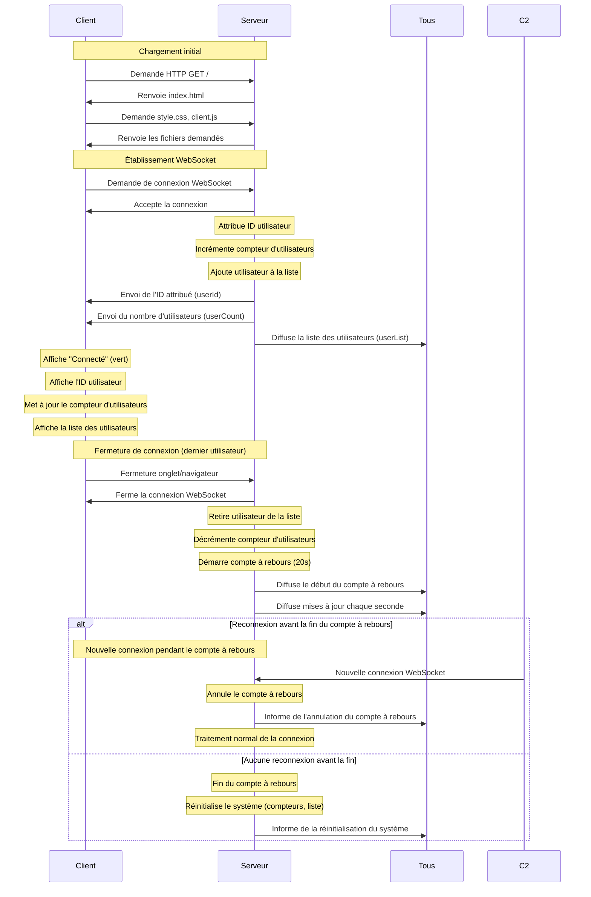

# Documentation Technique - Détails d'implémentation

Cette documentation technique complète le [README.md](../README.md) en fournissant des détails d'implémentation pour les développeurs.

## Détails d'architecture

### Diagramme de séquence détaillé



### Diagramme du système de compte à rebours

```mermaid
graph TD
    A[Dernier utilisateur se déconnecte] -->|connectedUsers === 0| B[Démarrage du compte à rebours]
    B -->|startCountdown()| C[Initialisation minuteur]
    C -->|Toutes les secondes| D{Temps restant > 0?}
    
    D -->|Oui| E[Mise à jour du temps]
    E -->|io.emit countdownUpdate| F[Notification des clients]
    F --> D
    
    D -->|Non| G[Réinitialisation du système]
    G -->|resetSystem()| H[Remise à zéro des compteurs]
    H -->|io.emit systemReset| I[Notification des clients]
    
    J[Nouvel utilisateur se connecte] -->|Pendant compte à rebours| K[Annulation du compte à rebours]
    K -->|cancelCountdown()| L[Arrêt du minuteur]
    L -->|io.emit countdownCancel| M[Notification des clients]
```

## Flux de données détaillé

### Côté serveur (server/index.js)

Le système de compte à rebours est implémenté comme suit:

```javascript
// Variables pour le compte à rebours
let countdownTimer = null;
const COUNTDOWN_DURATION = 20; // durée en secondes
let countdownRemaining = 0;

// Démarrage du compte à rebours quand le dernier utilisateur se déconnecte
function startCountdown() {
    // Initialisation du temps restant
    countdownRemaining = COUNTDOWN_DURATION;
    
    // Informer les clients du démarrage
    io.emit('countdownStart', countdownRemaining);
    
    // Envoyer une mise à jour chaque seconde
    countdownTimer = setInterval(() => {
        countdownRemaining--;
        
        // Envoyer la mise à jour
        io.emit('countdownUpdate', countdownRemaining);
        
        // Si le compte à rebours est terminé
        if (countdownRemaining <= 0) {
            resetSystem();
        }
    }, 1000);
}

// Annulation du compte à rebours quand un utilisateur se connecte
function cancelCountdown() {
    if (countdownTimer) {
        clearInterval(countdownTimer);
        countdownTimer = null;
        countdownRemaining = 0;
        
        // Informer les clients de l'annulation
        io.emit('countdownCancel');
    }
}

// Réinitialisation du système après le compte à rebours
function resetSystem() {
    // Arrêter le compte à rebours
    if (countdownTimer) {
        clearInterval(countdownTimer);
        countdownTimer = null;
    }
    
    // Réinitialiser les compteurs
    nextUserId = 1;
    
    // Informer les clients de la réinitialisation
    io.emit('systemReset');
}

// Vérifier si c'est le dernier utilisateur qui se déconnecte
socket.on('disconnect', () => {
    // Code existant...
    
    // Si c'était le dernier utilisateur, démarrer le compte à rebours
    if (connectedUsers === 0) {
        startCountdown();
    }
});

// Annuler le compte à rebours si un utilisateur se connecte pendant
io.on('connection', (socket) => {
    // Si un compte à rebours est en cours, l'annuler
    if (countdownTimer) {
        cancelCountdown();
    }
    
    // Code existant...
});
```

### Côté client (public/js/client.js)

Le client gère les événements du compte à rebours comme suit:

```javascript
// Début du compte à rebours
socket.on('countdownStart', (seconds) => {
    if (countdownContainerElement) {
        countdownContainerElement.style.display = 'block';
    }
    
    if (countdownElement) {
        countdownElement.textContent = seconds.toString();
    }
});

// Mise à jour du compte à rebours
socket.on('countdownUpdate', (seconds) => {
    if (countdownElement) {
        countdownElement.textContent = seconds.toString();
    }
});

// Annulation du compte à rebours
socket.on('countdownCancel', () => {
    if (countdownContainerElement) {
        countdownContainerElement.style.display = 'none';
    }
});

// Réinitialisation du système
socket.on('systemReset', () => {
    if (countdownContainerElement) {
        countdownContainerElement.style.display = 'none';
    }
});
```

## Notes d'implémentation

### Fonctionnement du compte à rebours

Le système de compte à rebours utilise `setInterval()` pour créer une minuterie qui s'exécute chaque seconde:

```javascript
countdownTimer = setInterval(() => {
    // Code à exécuter chaque seconde
}, 1000);
```

Pour annuler ce minuteur, nous utilisons `clearInterval()`:

```javascript
clearInterval(countdownTimer);
countdownTimer = null;
```

### États du système

Le système a plusieurs états possibles:
1. **Actif**: Au moins un utilisateur est connecté
2. **Compte à rebours**: Aucun utilisateur connecté, en attente de reconnexion
3. **Réinitialisé**: Après la fin du compte à rebours, prêt pour de nouvelles connexions

### Animation CSS

Pour attirer l'attention sur le compte à rebours, nous utilisons une animation CSS simple:

```css
#countdown-container {
    animation: pulse 1.5s infinite;
}

@keyframes pulse {
    0% { opacity: 1; }
    50% { opacity: 0.8; }
    100% { opacity: 1; }
}
```

## Détails d'implémentation par étape

### Étape 6: Compte à rebours

- Implémentation d'un système de compte à rebours de 20 secondes
- Démarrage automatique lorsque le dernier utilisateur se déconnecte
- Annulation automatique si un utilisateur se reconnecte avant la fin
- Réinitialisation du système à la fin du compte à rebours
- Communication en temps réel avec les clients potentiels
- Affichage visuel du compte à rebours avec animation

### Prochaines implémentations

#### Amélioration UI

Pour la prochaine étape, nous allons améliorer l'interface utilisateur:

- Regrouper et harmoniser les éléments visuels
- Ajouter des effets de transition entre les états
- Optimiser la disposition pour tous les appareils (responsive design)
- Améliorer l'accessibilité et la convivialité
- Ajouter des icônes et indicateurs visuels