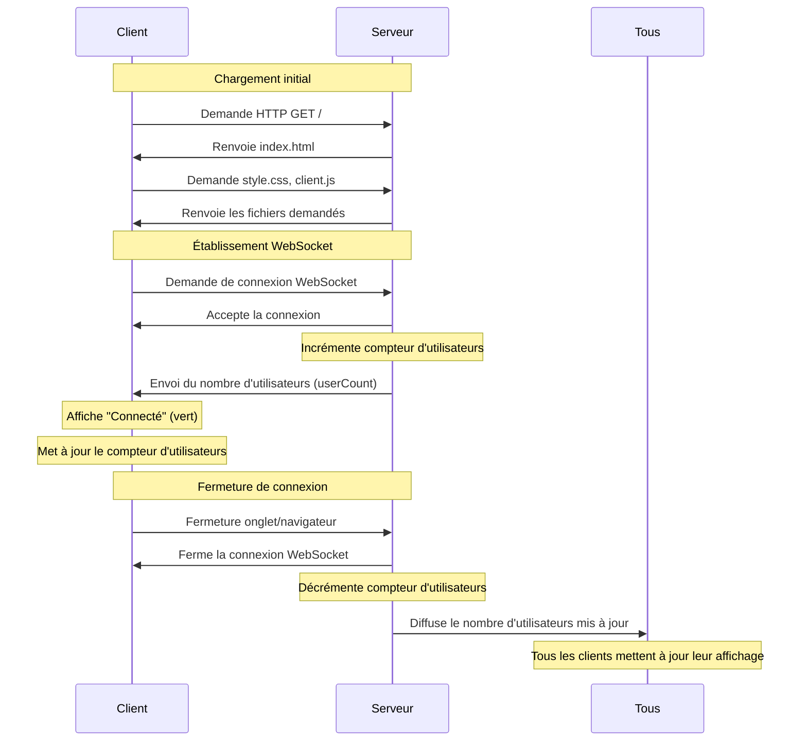
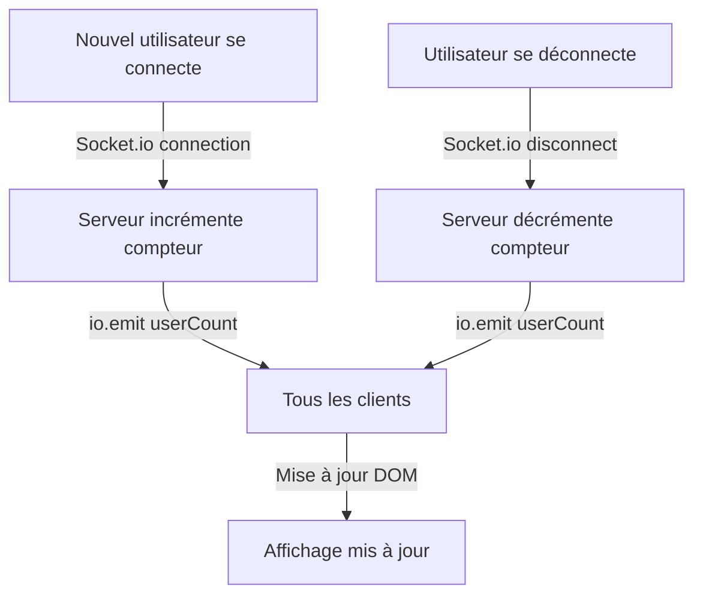

# Documentation Technique - Détails d'implémentation

Cette documentation technique complète le [README.md](../README.md) en fournissant des détails d'implémentation pour les développeurs.

## Détails d'architecture

### Diagramme de séquence détaillé



### Diagramme pour le compteur d'utilisateurs



## Flux de données détaillé

### Côté serveur (server/index.js)

```javascript
// Variable pour suivre le nombre d'utilisateurs connectés
let connectedUsers = 0;

// Nouvelle connexion
io.on('connection', (socket) => {
  // Incrémentation du compteur d'utilisateurs
  connectedUsers++;
  
  // Envoi du compteur à tous les clients (diffusion)
  io.emit('userCount', connectedUsers);
  
  // Déconnexion
  socket.on('disconnect', () => {
    // Décrémentation du compteur d'utilisateurs
    connectedUsers--;
    
    // Envoi du compteur mis à jour à tous les clients
    io.emit('userCount', connectedUsers);
  });
});
```

### Côté client (public/js/client.js)

```javascript
// Référence à l'élément DOM pour le compteur
const userCountElement = document.getElementById('user-count');

// Réception de la mise à jour du compteur
socket.on('userCount', (count) => {
    userCountElement.textContent = count.toString();
});
```

## Notes d'implémentation

### Diffusion des mises à jour (Broadcasting)

Pour envoyer une mise à jour à tous les clients connectés, nous utilisons `io.emit()` :

```javascript
io.emit('userCount', connectedUsers);
```

Cela envoie l'événement 'userCount' avec la valeur actuelle à tous les clients. 

Différentes méthodes de diffusion avec Socket.io :
- `io.emit()` : envoie à tous les clients
- `socket.emit()` : envoie uniquement au client spécifique
- `socket.broadcast.emit()` : envoie à tous sauf le client actuel

### Gestion des compteurs

Quelques points importants à noter :
- Le compteur est une variable simple côté serveur
- La valeur est envoyée aux clients uniquement lors des changements
- Chaque client reçoit la même valeur
- Le compteur est automatiquement mis à jour lors des connexions/déconnexions

## Détails d'implémentation par étape

### Étape 3 : Compteur d'utilisateurs

- Suivi du nombre d'utilisateurs connectés avec une variable
- Mise à jour du compteur lors des événements de connexion/déconnexion
- Diffusion des mises à jour à tous les clients connectés
- Affichage du compteur dans l'interface utilisateur

### Prochaines implémentations

#### Système d'IDs

Pour la prochaine étape, nous allons implémenter un système d'attribution d'IDs uniques :

- Attribuer un ID séquentiel (auto-incrémenté) à chaque nouvelle connexion
- Stocker l'ID avec les informations de connexion
- Envoyer l'ID attribué au client concerné

```javascript
// Exemple d'implémentation à venir
let nextUserId = 1;

io.on('connection', (socket) => {
  // Attribution d'un ID unique
  const userId = nextUserId++;
  
  // Stockage des informations utilisateur
  const user = {
    id: userId,
    socketId: socket.id,
    connectionTime: new Date().toISOString()
  };
  
  // Informer le client de son ID
  socket.emit('userId', userId);
});
```