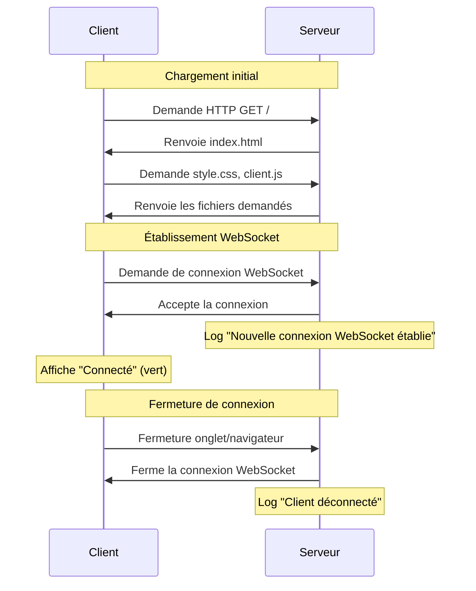

# Documentation Technique - Détails d'implémentation

Cette documentation technique complète le [README.md](../README.md) en fournissant des détails d'implémentation pour les développeurs.

## Détails d'architecture

### Diagramme de séquence détaillé



## Flux de données détaillé

### Côté serveur (server/index.js)

Le serveur utilise Socket.io intégré à Express pour gérer les connexions WebSocket :

```javascript
/**
 * Initialisation de Socket.io
 * 
 * ← Reçoit données de: Serveur HTTP Express
 * → Envoie données vers: Clients WebSocket
 */
const io = new Server(server);

/**
 * Gestion des connexions WebSocket
 * 
 * ← Reçoit données de: Client WebSocket (navigateur)
 */
io.on('connection', (socket) => {
  console.log('Nouvelle connexion WebSocket établie');
  
  /**
   * Gestion des déconnexions
   * 
   * ← Reçoit données de: Client WebSocket (navigateur)
   */
  socket.on('disconnect', () => {
    console.log('Client déconnecté');
  });
});
```

### Côté client (public/js/client.js)

Le client se connecte au serveur et gère les états de connexion :

```javascript
/**
 * Connexion au serveur WebSocket
 * 
 * → Envoie données vers: Serveur Socket.io
 */
const socket = io();

/**
 * Gestion de l'événement de connexion
 * 
 * ← Reçoit données de: Serveur Socket.io
 * → Modifie: DOM (interface utilisateur)
 */
socket.on('connect', () => {
    console.log('Connecté au serveur WebSocket');
    statusElement.textContent = 'Connecté';
    statusElement.className = 'connected';
});

/**
 * Gestion de l'événement de déconnexion
 * 
 * ← Reçoit données de: Serveur Socket.io
 * → Modifie: DOM (interface utilisateur)
 */
socket.on('disconnect', () => {
    console.log('Déconnecté du serveur WebSocket');
    statusElement.textContent = 'Déconnecté';
    statusElement.className = 'disconnected';
});
```

## Notes d'implémentation

### Configuration ES Modules

Ce projet utilise les ES Modules natifs de Node.js plutôt que CommonJS :

```json
{
  "type": "module"
}
```

Cela permet d'utiliser la syntaxe d'import/export moderne, mais nécessite des ajustements pour certaines fonctionnalités comme `__dirname` qui n'existent pas nativement en ES Modules.

### Servir les fichiers statiques

La méthode utilisée pour servir l'index.html :

```javascript
res.sendFile('index.html', { root: 'public' });
```

Cette approche est plus élégante que l'utilisation de chemins absolus avec `__dirname` car :
- Elle simplifie le code
- Elle est compatible avec les ES Modules
- Elle conserve la sécurité (contrôle des traversées de répertoire)

### Connectivité WebSocket

Socket.io offre plusieurs avantages par rapport à l'API WebSocket native :
- Reconnexion automatique en cas de perte de connexion
- Fallback vers d'autres protocoles si WebSocket n'est pas disponible
- API d'événements simple à utiliser

## Détails d'implémentation par étape

### Étape 1 : Structure initiale

- Utilisation d'Express pour le serveur HTTP
- Configuration des fichiers statiques
- Structure de base du projet

### Étape 2 : WebSocket basique

- Intégration de Socket.io au serveur Express
- Gestion des événements de connexion/déconnexion
- Interface utilisateur réactive aux changements d'état

### Prochaines implémentations

#### Compteur d'utilisateurs

Nous allons créer un mécanisme pour :
- Suivre le nombre d'utilisateurs connectés
- Stocker les données de manière centralisée
- Diffuser les mises à jour à tous les clients

#### Format des données

Nous utiliserons la structure suivante pour stocker les informations utilisateur :

```javascript
// Structure d'un utilisateur
{
  id: 1,                         // ID auto-incrémenté
  socketId: "abc123",            // Identifiant technique Socket.io
  connectionTime: "2025-05-05T12:34:56"  // Date/heure de connexion
}

// Collection d'utilisateurs actifs
const activeUsers = [];
```