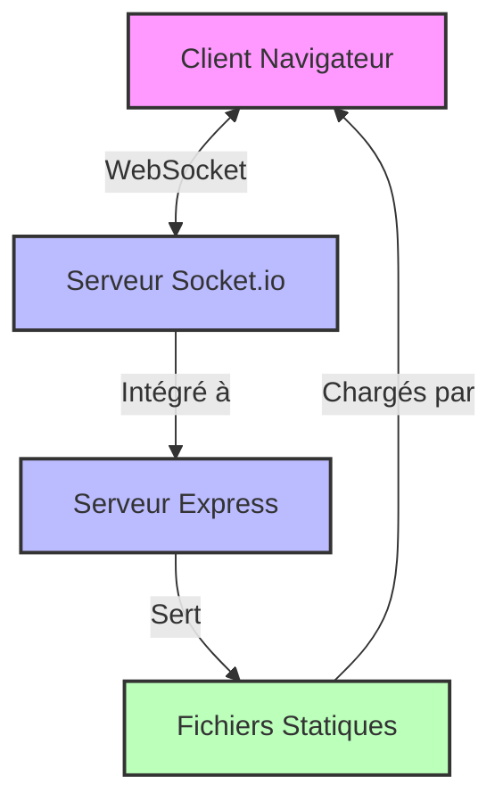
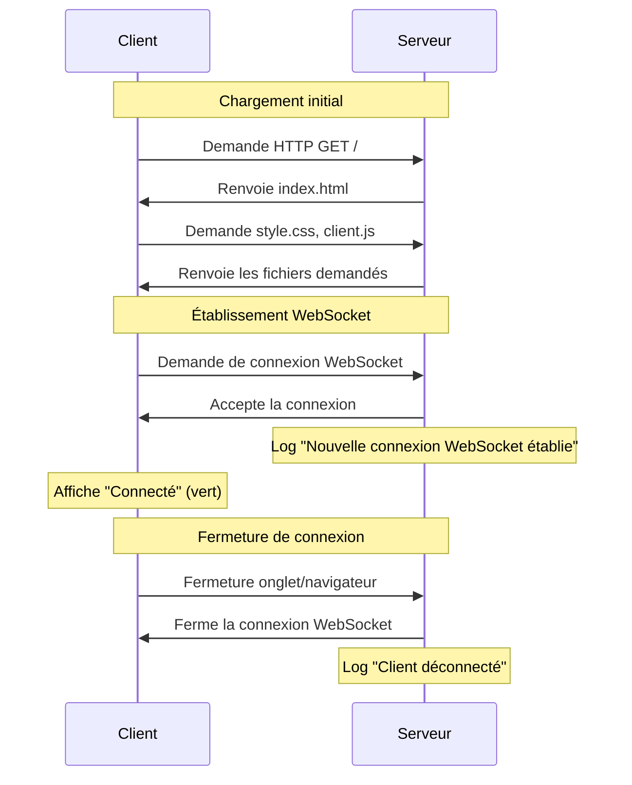

# Documentation Technique - Projet WebSocket

## Architecture du projet

Ce projet utilise une architecture client-serveur avec communication bidirectionnelle en temps réel via WebSocket.

### Structure des fichiers

```
websocket-demo/
├── node_modules/
├── public/
│   ├── css/
│   │   └── style.css       # Styles CSS pour l'interface utilisateur
│   ├── js/
│   │   └── client.js       # Client WebSocket et logique frontend
│   └── index.html          # Page HTML principale
├── server/
│   └── index.js            # Serveur Express et gestionnaire WebSocket
├── docs/
│   └── technical.md        # Cette documentation
├── .gitignore              # Fichiers ignorés par Git
└── package.json            # Configuration du projet
```

## Diagrammes

### Diagramme d'architecture



### Diagramme de séquence pour la connexion WebSocket



## Étapes implémentées

### 1. Structure initiale

- [x] Configuration du serveur Express
- [x] Structure des dossiers et fichiers de base
- [x] Page HTML minimale

**Détails techniques:**
- Utilisation des ES modules (type: "module" dans package.json)
- Configuration des fichiers statiques avec `app.use(express.static("public"))`
- Utilisation de la méthode `res.sendFile('index.html', { root: 'public' })` pour servir l'index

### 2. WebSocket basique

- [x] Intégration de Socket.io au serveur Express
- [x] Configuration du client WebSocket
- [x] Gestion des événements de connexion/déconnexion
- [x] Indicateur visuel de l'état de connexion

**Détails techniques:**
- Socket.io est intégré au serveur HTTP créé avec Express
- Le client Socket.io est automatiquement servi via `/socket.io/socket.io.js`
- Les événements `connect` et `disconnect` sont utilisés pour suivre l'état de la connexion

## Prochaines étapes

- [ ] Compteur d'utilisateurs - Suivi et affichage du nombre d'utilisateurs connectés
- [ ] Système d'IDs - Attribution d'IDs auto-incrémentés aux utilisateurs
- [ ] Listing d'utilisateurs - Affichage de la liste des utilisateurs connectés
- [ ] Compte à rebours - Implémentation du système de réinitialisation après déconnexion
- [ ] Amélioration UI - Soigner l'interface utilisateur
- [ ] Documentation finale - Finaliser la documentation complète