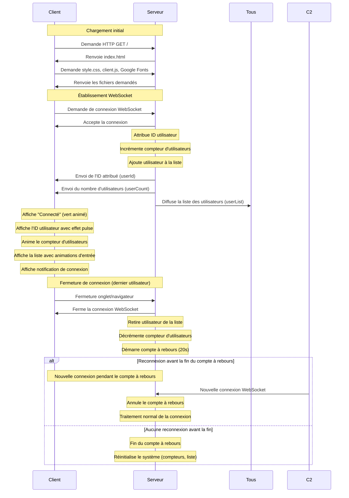

# Documentation Technique - Détails d'implémentation

Cette documentation technique complète le [README.md](../README.md) en fournissant des détails d'implémentation pour les développeurs.

## Détails d'architecture

### Diagramme de séquence détaillé



### Diagramme du système de compte à rebours (optimisé serveur uniquement)

```mermaid
graph TD
    A[Dernier utilisateur se déconnecte] -->|connectedUsers === 0| B[Démarrage du compte à rebours]
    B -->|startCountdown()| C[Initialisation minuteur]
    C -->|Toutes les secondes| D{Temps restant > 0?}
    
    D -->|Oui| E[Mise à jour du temps]
    E -->|process.stdout.write| F[Affichage console dynamique]
    F --> D
    
    D -->|Non| G[Réinitialisation du système]
    G -->|resetSystem()| H[Remise à zéro des compteurs]
    H -->|console.log| I[Log serveur de réinitialisation]
    
    J[Nouvel utilisateur se connecte] -->|Pendant compte à rebours| K[Annulation du compte à rebours]
    K -->|cancelCountdown()| L[Arrêt du minuteur]
    L -->|console.log| M[Log serveur d'annulation]
```

## Flux de données détaillé

### Côté serveur (server/index.js)

Le système de compte à rebours optimisé avec affichage console amélioré:

```javascript
function startCountdown() {
    countdownRemaining = COUNTDOWN_DURATION;
    console.log('Compte à rebours de réinitialisation démarré:');
    
    // Affichage immédiat de la première valeur
    process.stdout.write(`\rCompte à rebours: ${countdownRemaining} secondes avant réinitialisation du système.`);
    
    countdownTimer = setInterval(() => {
        countdownRemaining--;
        
        if (countdownRemaining <= 0) {
            resetSystem();
        } else {
            // Mise à jour sur la même ligne
            process.stdout.write(`\rCompte à rebours: ${countdownRemaining} secondes avant réinitialisation du système.`);
        }
    }, 1000);
}

function cancelCountdown() {
    if (countdownTimer) {
        clearInterval(countdownTimer);
        countdownTimer = null;
        countdownRemaining = 0;
        
        // Effacer la ligne et afficher le message d'annulation
        process.stdout.write('\r\x1b[K');
        console.log('Compte à rebours annulé - Nouvel utilisateur connecté');
    }
}
```

### Côté client (public/js/client.js)

Le client avec améliorations UX et animations:

```javascript
// Animation des nombres avec effet de comptage
function animateNumber(element, newValue) {
    const currentValue = parseInt(element.textContent) || 0;
    const difference = newValue - currentValue;
    const duration = 500;
    const steps = 20;
    const stepValue = difference / steps;
    
    let currentStep = 0;
    const animation = setInterval(() => {
        currentStep++;
        const intermediateValue = Math.round(currentValue + (stepValue * currentStep));
        element.textContent = intermediateValue.toString();
        
        if (currentStep >= steps) {
            clearInterval(animation);
            element.textContent = newValue.toString();
        }
    }, duration / steps);
}

// Système de notifications temporaires
function showNotification(message, type = 'info') {
    const notification = document.createElement('div');
    notification.style.cssText = `
        position: fixed; top: 20px; right: 20px;
        padding: 1rem 1.5rem; border-radius: 8px;
        color: white; font-weight: 600; z-index: 1000;
        animation: slideInRight 0.3s ease-out;
    `;
    
    document.body.appendChild(notification);
    
    // Suppression automatique après 3 secondes
    setTimeout(() => {
        notification.style.animation = 'slideOutRight 0.3s ease-in';
        setTimeout(() => notification.remove(), 300);
    }, 3000);
}
```

## Détails d'implémentation de l'interface moderne

### Architecture CSS moderne

Le système de design utilise plusieurs concepts avancés:

#### Variables CSS pour la cohérence
```css
:root {
    --primary-color: #2563eb;
    --success-color: #10b981;
    --transition: all 0.3s cubic-bezier(0.4, 0, 0.2, 1);
    --shadow-medium: 0 4px 6px -1px rgba(0, 0, 0, 0.1);
    --border-radius: 12px;
}
```

#### Système de cartes uniforme
```css
.section-card {
    margin: 1.5rem 0;
    padding: 1.5rem;
    border-radius: var(--border-radius);
    transition: var(--transition);
    position: relative;
}

.section-card::before {
    content: '';
    position: absolute;
    top: 0; left: 0;
    width: 4px; height: 100%;
    background: var(--accent-color);
}

.section-card:hover {
    transform: translateY(-2px);
    box-shadow: var(--shadow-medium);
}
```

#### Animations d'entrée échelonnées
```css
@keyframes fadeInUp {
    from {
        opacity: 0;
        transform: translateY(20px);
    }
    to {
        opacity: 1;
        transform: translateY(0);
    }
}

.section-card:nth-child(1) { animation-delay: 0.1s; }
.section-card:nth-child(2) { animation-delay: 0.2s; }
```

### Responsive Design

Le design s'adapte à trois points de rupture principaux:

#### Desktop (> 768px)
- Layout en colonnes avec espacement généreux
- Animations complètes et effets de survol
- Typographie grande et lisible

#### Tablette (768px - 480px)
```css
@media (max-width: 768px) {
    .container { padding: 1.5rem; }
    h1 { font-size: 2rem; }
    #user-list li {
        flex-direction: column;
        gap: 0.5rem;
        text-align: center;
    }
}
```

#### Mobile (< 480px)
```css
@media (max-width: 480px) {
    h1 { font-size: 1.5rem; }
    #user-count { font-size: 1.5rem; }
    #user-id { font-size: 1.25rem; }
}
```

### Système d'animations JavaScript

#### Animation des listes avec décalage
```javascript
users.forEach((user, index) => {
    setTimeout(() => {
        // Création et ajout de l'élément
        const listItem = createUserElement(user);
        
        // Animation d'entrée
        listItem.style.opacity = '0';
        listItem.style.transform = 'translateY(20px)';
        userListElement.appendChild(listItem);
        
        setTimeout(() => {
            listItem.style.transition = 'all 0.3s ease-out';
            listItem.style.opacity = '1';
            listItem.style.transform = 'translateY(0)';
        }, 10);
    }, index * 100); // Décalage de 100ms entre chaque élément
});
```

## Notes d'implémentation

### Performance des animations

**Optimisations appliquées**:
- Utilisation de `transform` et `opacity` pour des animations GPU-accélérées
- `will-change` implicite via les transitions CSS
- Limitation du nombre d'animations simultanées
- Nettoyage automatique des éléments de notification

### Accessibilité

**Améliorations d'accessibilité**:
- Structure sémantique HTML5 (header, main, section, footer)
- Contrastes de couleurs conformes WCAG 2.1
- Animations respectueuses (pas de clignotement rapide)
- Textes alternatifs pour les émojis décoratifs

### Compatibilité navigateurs

**Fonctionnalités modernes utilisées**:
- CSS Grid et Flexbox pour les layouts
- Variables CSS (Custom Properties)
- Animations CSS avec `cubic-bezier`
- ES6+ (const, let, arrow functions, template literals)

**Support minimal requis**:
- Chrome 49+, Firefox 31+, Safari 9.1+, Edge 16+

## API interne et événements WebSocket

### Événements émis par le serveur

#### `userCount`
```javascript
// Émis à tous les clients quand le nombre d'utilisateurs change
io.emit('userCount', connectedUsers);
```
**Données envoyées** : `number` - Nombre total d'utilisateurs connectés
**Fréquence** : À chaque connexion/déconnexion

#### `userId` 
```javascript
// Émis uniquement au client qui vient de se connecter
socket.emit('userId', userId);
```
**Données envoyées** : `number` - ID unique attribué à l'utilisateur
**Fréquence** : Une seule fois par connexion

#### `userList`
```javascript
// Émis à tous les clients quand la liste change
io.emit('userList', userList);
```
**Données envoyées** : `Array<{id: number, connectionTime: string}>` - Liste filtrée des utilisateurs
**Fréquence** : À chaque connexion/déconnexion

### Événements reçus par le client

#### `connect`
```javascript
socket.on('connect', () => {
    // Connexion établie avec le serveur
});
```

#### `disconnect`
```javascript
socket.on('disconnect', () => {
    // Connexion perdue avec le serveur
});
```

### Structure des données

#### Objet utilisateur (côté serveur)
```javascript
{
    id: 1,                           // ID séquentiel unique
    socketId: 'abc123def456',        // ID technique Socket.io
    connectionTime: '2025-05-05T...' // Timestamp ISO 8601
}
```

#### Objet utilisateur (côté client)
```javascript
{
    id: 1,                           // ID séquentiel unique
    connectionTime: '2025-05-05T...' // Timestamp ISO 8601
    // socketId filtré pour la sécurité
}
```

## Guide de personnalisation

### Modifier les couleurs

Changez les variables CSS dans `public/css/style.css` :
```css
:root {
    --primary-color: #your-color;
    --success-color: #your-color;
    --warning-color: #your-color;
}
```

### Modifier la durée du compte à rebours

Dans `server/index.js` :
```javascript
const COUNTDOWN_DURATION = 30; // Nouvelle durée en secondes
```

### Ajouter de nouveaux événements WebSocket

#### Côté serveur
```javascript
// Émission d'un nouvel événement
socket.emit('customEvent', data);

// Écoute d'un événement du client
socket.on('clientEvent', (data) => {
    // Traitement
});
```

#### Côté client
```javascript
// Écoute du nouvel événement
socket.on('customEvent', (data) => {
    // Traitement et mise à jour UI
});

// Émission vers le serveur
socket.emit('clientEvent', data);
```

### Ajouter des animations personnalisées

#### CSS
```css
@keyframes customAnimation {
    from { /* état initial */ }
    to { /* état final */ }
}

.custom-element {
    animation: customAnimation 0.5s ease-out;
}
```

#### JavaScript
```javascript
function customAnimation(element) {
    element.style.transition = 'all 0.3s ease-out';
    element.style.transform = 'scale(1.1)';
    
    setTimeout(() => {
        element.style.transform = 'scale(1)';
    }, 300);
}
```

## Optimisations de performance

### Côté serveur

**Gestion mémoire** :
- Le tableau `activeUsers` est nettoyé automatiquement
- Les timers sont correctement supprimés avec `clearInterval()`
- Pas de fuites mémoire dans les event listeners

**Optimisations réseau** :
- Filtrage des données sensibles avant envoi (socketId)
- Événements diffusés uniquement quand nécessaire
- Pas de polling, uniquement des événements push

### Côté client

**Animations performantes** :
- Utilisation de `transform` et `opacity` (GPU-accélérés)
- Limitation du nombre d'animations simultanées
- Nettoyage automatique des éléments temporaires

**Gestion DOM** :
- Sélection d'éléments mise en cache
- Modifications DOM groupées quand possible
- Évitement des reflows/repaints inutiles

## Tests et débogage

### Logs de débogage

#### Activer les logs Socket.io
```javascript
// Dans le navigateur (F12 > Console)
localStorage.debug = 'socket.io-client:socket';

// Puis rechargez la page
location.reload();
```

#### Logs personnalisés
```javascript
// Ajoutez dans client.js pour plus de détails
socket.onAny((event, ...args) => {
    console.log(`Événement reçu: ${event}`, args);
});
```

### Tests de charge

Pour tester avec de nombreuses connexions simultanées :

```javascript
// Script de test à exécuter dans la console du navigateur
for (let i = 0; i < 10; i++) {
    setTimeout(() => {
        window.open(window.location.href);
    }, i * 100);
}
```

### Métriques de performance

Surveillez ces indicateurs :
- **Temps de connexion WebSocket** : < 100ms normalement
- **Latence des événements** : < 50ms pour les mises à jour
- **Utilisation mémoire** : Stable dans le temps (pas de fuites)
- **CPU serveur** : < 5% en utilisation normale

## Sécurité

### Bonnes pratiques implémentées

- **Filtrage des données** : socketId non exposé côté client
- **Validation des entrées** : Types vérifiés avant traitement
- **Pas d'exécution de code** : Aucun `eval()` ou équivalent
- **CORS approprié** : Socket.io configuré pour l'origine correcte

### Améliorations possibles

Pour un environnement de production :
- **Rate limiting** : Limiter les connexions par IP
- **Authentification** : Système de tokens/sessions
- **Validation stricte** : Schemas de validation pour tous les événements
- **Logs de sécurité** : Surveillance des connexions suspectes

## Contributions et développement

### Architecture modulaire

Le code est organisé pour faciliter les extensions :
- **Séparation claire** : Serveur, client, styles séparés
- **Fonctions utilitaires** : Code réutilisable isolé
- **Configuration centralisée** : Constantes en haut des fichiers

### Standards de code

- **ES6+** : Utilisation des fonctionnalités modernes
- **Commentaires explicatifs** : Code documenté en français
- **Noms descriptifs** : Variables et fonctions explicites
- **Gestion d'erreurs** : Try/catch et vérifications appropriées

### Extensions suggérées

#### Niveau débutant
- Changer les couleurs et animations
- Ajouter des émojis ou icônes personnalisés
- Modifier les messages affichés

#### Niveau intermédiaire  
- Ajouter des "salles" (rooms) pour séparer les utilisateurs
- Implémenter un système de pseudonymes
- Créer un historique des connexions

#### Niveau avancé
- Intégrer une base de données (MongoDB/PostgreSQL)
- Ajouter un système d'authentification
- Créer une API REST complémentaire
- Implémenter des tests automatisés

Cette documentation technique sert de référence complète pour comprendre, maintenir et étendre ce prototype WebSocket.